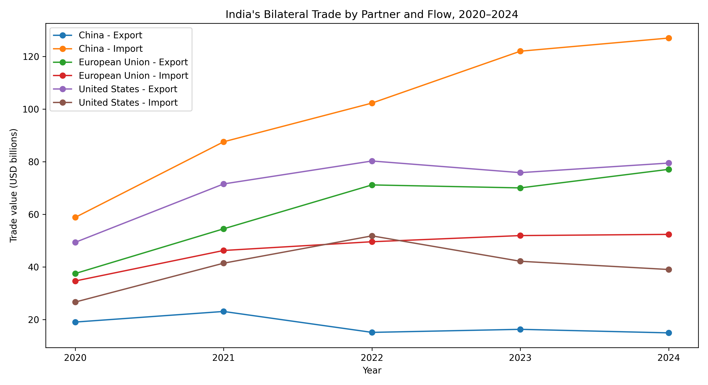
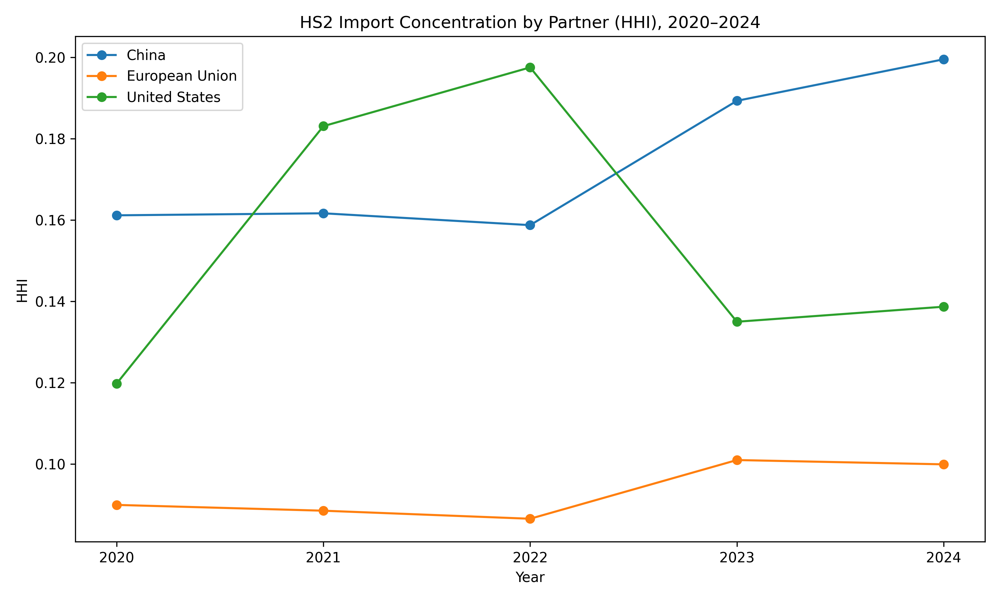
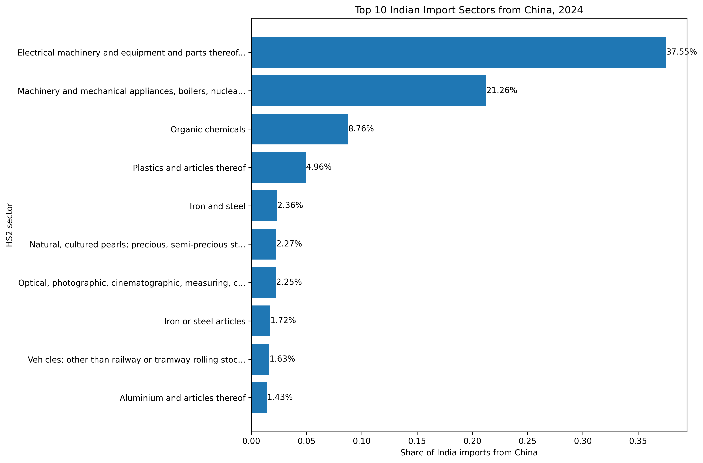
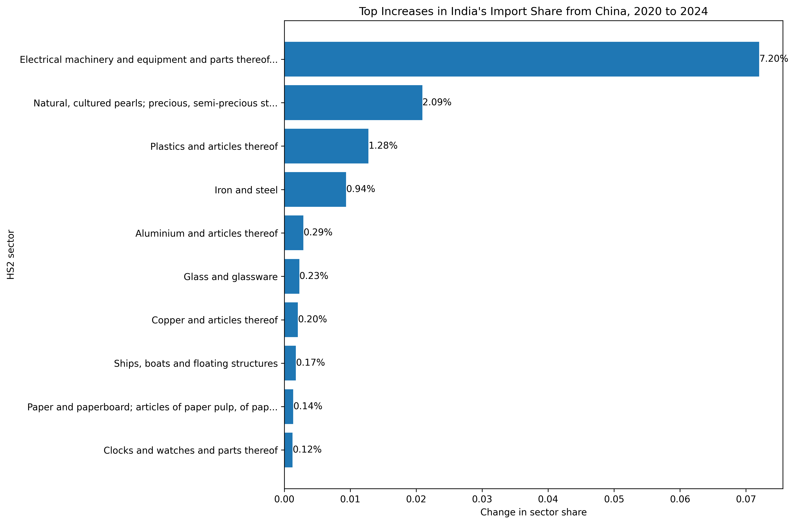
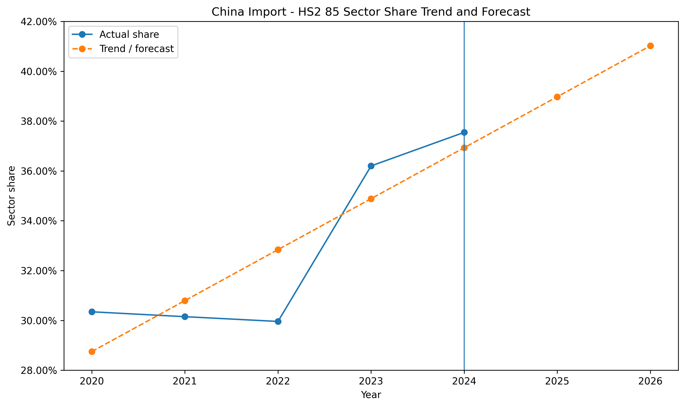
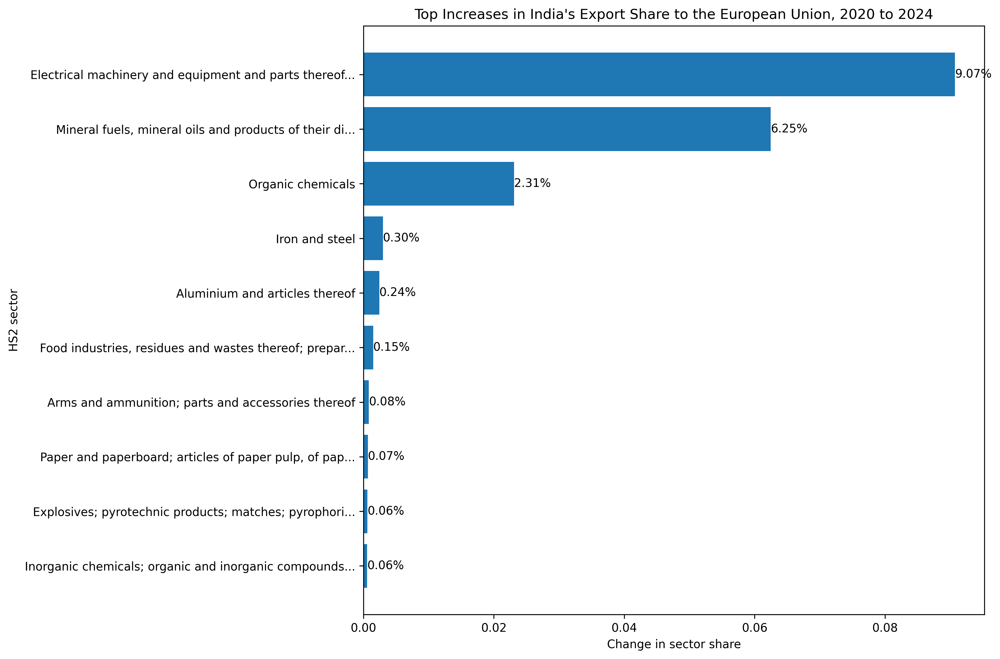
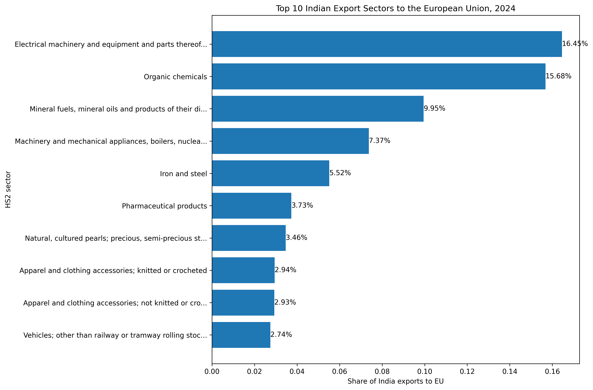
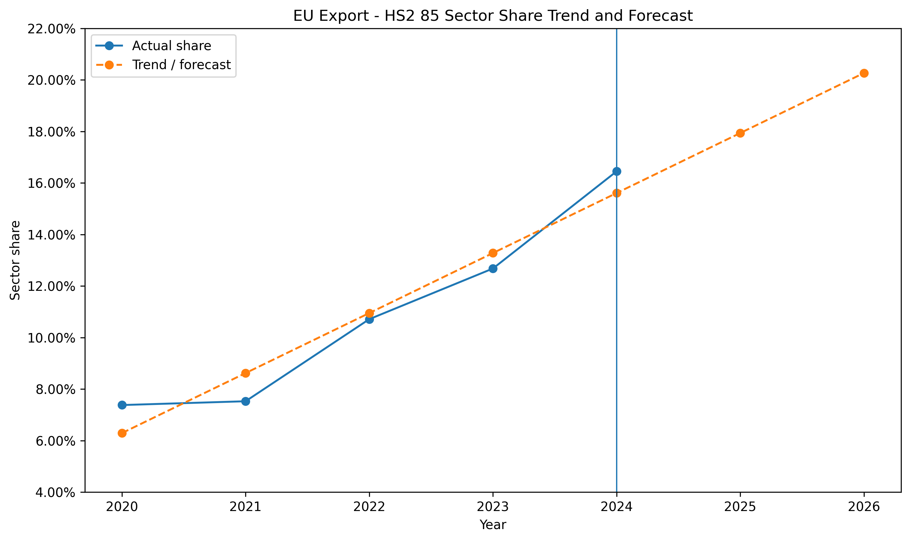

---
title: "Can the India–EU FTA reduce India’s trade concentration risk?"
subtitle: A sectoral analysis of trade patterns and trends
author: "Yeswanth Rongali"
format:
  html:
    toc: true
    toc-depth: 2
    number-sections: true
    theme: cosmo
execute:
  echo: false
  warning: false
  message: false
editor: visual
--- 

## Methodology

This analysis uses annual goods-trade data from UN Comtrade covering 2020 to 2024. Two datasets are used. The first is total bilateral goods trade, which compares the overall size, direction, and trade balance of India’s relationships with China, the United States, and the European Union. The second is HS2 sector-level trade data, which identifies sector concentration, product groups, and changes in sector shares over time. All flow directions, concentration measures, and sector-share forecasts are standardised to India’s perspective, even where this is not restated in every figure.

## Introduction: The Shifting Waves of Global Trade

Global trade is no longer shaped only by comparative advantage and economic efficiency. It is increasingly influenced by rivalry, supply-chain control, and strategic vulnerability, which can be weaponised. In recent times, tariffs, export controls, industrial subsidies, and efforts to de-risk from geopolitical rivals have replaced much of the optimism that once defined hyper-globalisation. For India, this shift creates a serious strategic problem. It sits between the world’s largest economic blocs — China, the United States, and the European Union — but its trade relationships with them are not equally secure.

A surface-level overview of India’s trade data suggests a delicate balancing act. The United States and the European Union are major destinations for Indian exports, while China remains an outsized supplier of goods on which Indian production networks depend. Yet total trade volumes hide the real issue. Not all trade creates the same kind of exposure. Importing consumer goods is one thing; depending on a geopolitical rival for strategically important manufacturing inputs is another.

{fig-alt="India's bilateral trade by partner and flow from 2020 to 2024." fig-cap="Figure 1. India’s bilateral trade by partner and flow, 2020–2024." width="100%"}

However, looking at just total trade volumes hides the true danger. To understand a country's economic vulnerability, one must look beyond macroeconomic aggregates and examine the specific sectors driving those numbers. Not all trade can be deemed equal. Importing millions of dollars of textiles is vastly different from importing millions of dollars of critical technology.

In early 2026, India and the European Union signed a historic Free Trade Agreement (FTA), effectively ending nearly two decades of stalled negotiations. While celebrated as an economic milestone, the underlying trade structure suggests the agreement may also serve as a geopolitical shield for India.

## The Chinese Chokehold is Concentrated

To understand why it is a geopolitical shield, it is crucial to identify where India is truly vulnerable; it cannot be inferred by just looking at how much it imports from China overall. It needs to be further analysed through the lens of "concentration risk." A massive trade deficit isn't automatically dangerous if you are importing thousands of different products. But if an entire economy relies on a single country for a very narrow, specific set of critical goods, then that country is exposed and vulnerable.

In economics, this can be measured using the Herfindahl–Hirschman Index (HHI), which measures how concentrated trade is across sectors. A higher HHI means a trade relationship is driven by fewer sectors, making it more vulnerable to targeted supply-chain shocks, while a lower HHI suggests greater diversification. When the HHI for India’s imports across its major partners is plotted, a stark reality emerges.

{fig-alt="Concentration of Sectoral Import from Countries from 2020 to 2024." fig-cap="Figure 2. HS2 Import Concentration by India's partner (HHI), 2020–2024." width="100%"}

This is where concentration becomes crucial. A large trade relationship is not automatically dangerous if it is broad and diversified. But India’s relationship with China is becoming increasingly dominated by a narrow set of sectors. This is visible in the Herfindahl–Hirschman Index (HHI) sector-share chart. India's import basket with China is significantly more concentrated than its imports from the US or the EU, and that concentration has spiked sharply since 2022. This means India is not just buying a lot of random goods from China; it is structurally dependent on China for a very specific set of inputs.

The more important question is what exactly is dominating that import relationship. To answer that, the analysis breaks trade into HS2 categories, referring to the 2-digit level of the Harmonized System, a standard international classification used to group traded goods into broad sectors such as electrical machinery, pharmaceuticals, mineral fuels, and iron and steel.

{fig-alt="Top ten Indian import sectors from China in 2024." fig-cap="Figure 3. Top 10 Indian import sectors from China, 2024." width="100%"}

Once India’s imports from China are decomposed this way, one sector stands out overwhelmingly: HS 85 — Electrical machinery and equipment and parts thereof. This category includes highly advanced microchips, consumer electronics, telecommunications equipment, industrial electrical parts, and many of the intermediate goods that underpin digital and manufacturing supply chains. In a modern economy, it is not just another import category; it includes many of the components and intermediate goods linked to the development of artificial intelligence, green energy grids, and modern defence systems. By 2024, more than 37% of India’s imports from China were concentrated in this single category.

{fig-alt="Top ten Indian import sectors from China in 2024." fig-cap="Figure 4. Top Increases in India's Import share from China, 2020 to 2024." width="100%"}

Over time, the HS 85 sector's share rose by 7.20 percentage points, making it the largest increase among China-sourced sectors. That matters because concentration turns trade into leverage. If one partner supplies many essential goods, and especially through one dominant category, a disruption in that relationship can cascade through domestic production. This is why the China relationship is not merely a bilateral imbalance. It is a form of sector-specific dependence.

To assess where this trend might be heading, the analysis applies an ordinary least squares (OLS) time-trend model to HS 85’s share of India’s imports from China. The purpose is not to produce a structural macro forecast, but to estimate whether recent dependence is likely to keep intensifying if current dynamics continue.

{fig-alt="Trend and forecast for HS2 85 as a share of India's imports from China." fig-cap="Figure 5. India Import share trend and forecast from China's HS2 85." width="100%"}

The resulting forecast is alarming. If the recent trend continues, HS 85 could account for roughly 41% of India’s imports from China by 2026. The forecast is less smooth because the observed data show a visible jump after 2022, but the direction is still clear: India’s dependence on the most strategically important technology sector is not stabilising. It is deepening.

## The European Opportunity 
If China represents the dependence problem, the natural question is whether Europe represents part of the solution. The answer is not as simple as "replace China with the EU", because trade structures do not adjust that smoothly. But the data do reveal a compelling opportunity.

When the direction of trade is reversed and India’s exports to the European Union are examined, the same broad sector appears again: HS 85. This time, however, it appears not as a source of vulnerability, but as a source of opportunity. Between 2020 and 2024, the share of HS 85 in India’s export basket to the EU increased by 9.07 percentage points, making it one of the fastest-rising export sectors in the European relationship.

{fig-alt="Top ten Indian export sectors to the European Union in 2024." fig-cap="Figure 6. Top Increases in India's Export share to the European Union, 2020 to 2024." width="100%"}

This reveals a crucial asymmetry. In the Chinese case, HS 85 signals concentrated import exposure. In the European case, it signals export capability. India is not simply stuck importing electronics-related goods from China; it is also strengthening its own outward position by increasingly exporting to the European Union.

India’s export structure to the European Union reinforces this point. India’s exports to the EU are led by electrical machinery, but they are not overwhelmingly dominated by it. Other sectors — including organic chemicals, mineral fuels, iron and steel, and pharmaceuticals — also contribute meaningfully. That matters because it suggests the EU-facing export basket is not as narrowly dependent on one single category as India’s China-facing import basket. 

{fig-alt="Top ten Indian export sectors to the European Union in 2024." fig-cap="Figure 7. Top 10 Indian export sectors to the European Union, 2024." width="100%"}

This is also consistent with the concentration evidence. From India’s perspective, imports from the EU are much less concentrated than imports from China, as shown by the lower HHI in figure 2. However, this does not mean Europe is automatically safe or perpetuates the idea that no sector matters more than others. What it means is that India’s imports from the EU are more diversified, and therefore less exposed to one-sector dominance. In practical terms, that makes the EU a more attractive partner for diversification.

The OLS forecast adds a forward-looking dimension. Applied to HS 85’s share in India’s exports to the EU, it shows a clear positive trend and projects the sector crossing 20% of India’s EU export basket by 2026 if recent patterns continue. This is what makes the EU relationship strategically distinct: Europe is becoming a stronger destination in a sector where India’s external capabilities are visibly improving.

{fig-alt="Trend and forecast for HS2 85 as a share of India's exports to the European Union." fig-cap="Figure 8. India Export share trend and forecast to the European Union's HS2 85." width="100%"}

## The FTA as a Diversification Strategy

This is where the free trade agreement (FTA) becomes analytically important. The value of the India–EU FTA is not that it will suddenly erase India’s dependence on Chinese imports. It will not. China’s role in India’s supply chain, especially in electrical machinery, is too large and too deeply embedded for that kind of one-step quick replacement hypothesis.

What the FTA can do, however, is shift the structure of India’s trade in a more resilient direction.

If tariffs fall and regulatory barriers decline between India and the EU, as the FTA is intended to facilitate, Indian exporters gain easier access to one of the world’s richest consumer markets. That matters because rising export demand gives Indian firms stronger incentives to invest, scale production, and deepen domestic supply chains. In sectors such as electrical machinery, this is especially important: a larger and more reliable export market can support the industrial expansion India would need if it wants to reduce long-run reliance on Chinese inputs.

The concentration evidence strengthens this interpretation. China is currently the clearest example of concentrated import dependence for India, while India’s trade structure with the EU is broader and more balanced. The forecast figures showcase the dynamic element. India's critical import dependence on Chinese tech appears to be rising. India’s export position in Europe’s market also appears to be rising. Taken together, the implication is not that Europe can replace China directly, but that Europe can widen the set of non-China channels through which India expands strategically important trade.

This makes the FTA less of a generic trade agreement and more of a diversification instrument. It may help India in at least three ways. First, it can deepen export growth in sectors where India is already gaining share. Second, it can reduce the relative weight of the most deficit-heavy and concentration-heavy bilateral relationship in India’s trade portfolio. Third, it can encourage domestic industrial scaling by making external demand more secure.

None of this implies automatic success. Even with the FTA, India may still face import competition from European manufacturers, and deeper integration could also bring pressure on domestic Indian firms. The FTA therefore creates both opportunity and adjustment pressure. From a strategic perspective, however, the starting position with Europe is still far more favourable than the starting position with China.

## Conclusion

The central lesson of the data is that India’s trade problem is not simply one of volume, but of structure.

China is not only a large trading partner; it is a highly concentrated and increasingly dominant source of imports in one of the most important manufacturing sectors of the modern economy. By 2024, electrical machinery accounted for more than a third of India’s imports from China, and both the HHI and the trend forecast suggest that this dependence is intensifying rather than fading.

The European Union presents a different picture. India already exports strongly to Europe in several sectors, and electrical machinery is becoming increasingly important within that export basket. India’s imports from the EU are also more diversified than its imports from China, making it less vulnerable to one-sector dominance. The forecast evidence therefore points in two directions at once: India’s Chinese import dependency risk is rising, but so too is its EU-facing export opportunity.

The India–EU FTA should therefore be understood as a strategic instrument of diversification. It is unlikely to break China’s hold immediately, and it does not prove one-for-one substitutability across sectors. But it may help India do something equally important: reduce the long-run risk of remaining locked into a concentrated import relationship with a geopolitical rival, while expanding its own capabilities in sectors that are becoming central to global trade.
